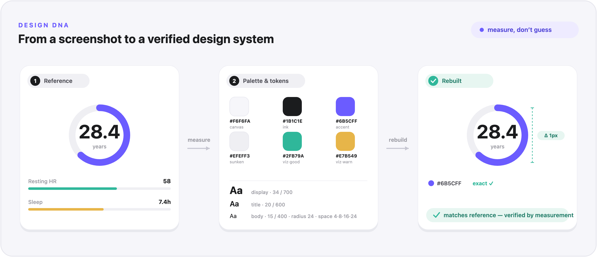
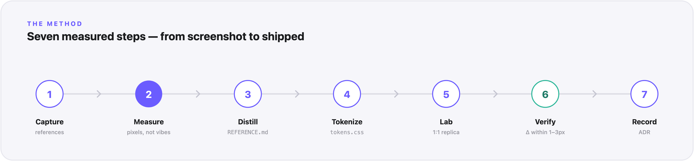

# Design DNA

**Give your AI coding agent a screenshot of a design you admire — get back a
real, verified design system.** It measures the colors, type, and spacing from
the actual pixels, turns them into reusable tokens, rebuilds the UI in an
isolated lab, and proves the copy matches by measurement — not by eye.



Built for **Claude Code** first, and it works in **Cursor, Codex, Windsurf, and
GitHub Copilot** too — same method, one file per tool.

---

## Why this exists

Most "match this design" attempts fail the same way: someone eyeballs a hex
code, guesses a font size, and ships something that's *almost* right in a dozen
small ways. Design DNA replaces guessing with measuring, and replaces "looks
close" with a number you can check.

The one rule: **measure, don't guess.**



1. **Capture** the reference images and note the device scale.
2. **Measure** exact colors, type sizes, spacing, and radii from real pixels.
3. **Distill** the findings into a written `REFERENCE.md` with named principles.
4. **Tokenize** into a raw + semantic token layer (light and dark).
5. **Lab** — rebuild a 1:1 replica in a sandbox, using only the tokens.
6. **Verify** the rebuild against the reference with `getBoundingClientRect` and
   color sampling — within 1–3px, exact on color.
7. **Record** the direction as an ADR, then promote it to production.

See the full method in [`skills/design-dna/SKILL.md`](skills/design-dna/SKILL.md),
and a worked example (the artifacts it produces) in
[`examples/sleep-card/`](examples/sleep-card/).

---

## Install

### Claude Code (recommended)

Add this repo as a plugin marketplace, then install the plugin:

```
/plugin marketplace add fasterv410/design-dna
/plugin install dna@design-dna
```

That's it. You now have:

- a **skill** that activates automatically when you talk about matching a
  reference,
- a family of **`/dna:*`** slash commands to run any part of the method
  explicitly (see [Use it](#use-it)),
- a **`design-engineer`** subagent you can hand the job to.

> Prefer not to install a plugin? Copy `skills/design-dna/` into your project's
> `.claude/skills/` folder and it works the same way.

### Cursor

Copy the rule into your project:

```bash
mkdir -p .cursor/rules
curl -fsSL https://raw.githubusercontent.com/fasterv410/design-dna/main/adapters/cursor/design-dna.mdc \
  -o .cursor/rules/design-dna.mdc
```

Cursor applies it automatically when a task matches, or attach it with
`@design-dna`.

### OpenAI Codex (and any `AGENTS.md` agent)

Codex, Gemini CLI, Jules, and others read [`AGENTS.md`](AGENTS.md) from your
project root:

```bash
curl -fsSL https://raw.githubusercontent.com/fasterv410/design-dna/main/AGENTS.md \
  -o AGENTS.md
```

If you already have an `AGENTS.md`, append the section instead of overwriting.
For Codex you can also drop it at `~/.codex/AGENTS.md` to enable it everywhere.

### Windsurf

```bash
mkdir -p .windsurf/rules
curl -fsSL https://raw.githubusercontent.com/fasterv410/design-dna/main/adapters/windsurf/design-dna.md \
  -o .windsurf/rules/design-dna.md
```

### GitHub Copilot

Append the contents of
[`adapters/copilot/copilot-instructions.md`](adapters/copilot/copilot-instructions.md)
to your project's `.github/copilot-instructions.md` (create it if it doesn't
exist).

---

## Use it

Point your agent at a reference image and ask for the method.

**Any tool — just ask:**

> Run the Design DNA method on this screenshot: `./references/dashboard.png`

**Claude Code — explicit `/dna:*` commands.** The method is split into steps you
can call on their own, so you measure once and build many times:

| Command | Steps | What it does | Example |
|---------|-------|--------------|---------|
| **`/dna:extract`** | 1–7 | The full pipeline — a screenshot in, a verified token system out. Start here. | `/dna:extract ./references/dashboard.png` |
| **`/dna:measure`** | 1–2 | Just pull the exact colors, type, and spacing numbers out of an image. | `/dna:measure ./ref.png` |
| **`/dna:tokens`** | 3–4 | Write `REFERENCE.md` + `tokens.css` (raw + semantic, light/dark). | `/dna:tokens ./ref.png` |
| **`/dna:build`** | 5–7 | Build a **new** screen from **existing** tokens — no re-measuring. Round two. | `/dna:build a settings screen from ./tokens.css` |
| **`/dna:verify`** | 6 | Measure a rebuild against its reference and report the deltas. | `/dna:verify /lab vs ./ref.png` |
| **`/dna:adr`** | 7 | Record the chosen direction as an ADR (supersede, don't delete). | `/dna:adr Soft Instrument` |

> Always type the **`dna:`** prefix. The commands are also available bare
> (`/build`, `/verify`, `/tokens`…), but those generic names can collide with
> other plugins — `/dna:*` is always unambiguous.

The typical flow: **`/dna:extract`** once to establish the system, then
**`/dna:build`** for every screen after that. A full run hands you:

- `REFERENCE.md` — the measured palette (with roles), type scale, spacing/radius
  law, depth model, and named principles.
- a token file — raw + semantic layers, light and dark.
- a lab replica rendered only from tokens.
- a verification table with the measured deltas.
- an ADR recording the direction.

You supply the sandbox to build the lab in (a scratch route, a Storybook story);
the method tells the agent how to use it and how to measure the result.

---

## What's in the box

```
design-dna/
├─ skills/design-dna/          # the method (Claude skill + source of truth)
│  ├─ SKILL.md
│  └─ references/              # color measurement, verification, ADR template
├─ commands/                   # the /dna:* slash commands
│  ├─ extract.md  measure.md  tokens.md  build.md  verify.md  adr.md
├─ agents/design-engineer.md   # the design-engineer subagent
├─ AGENTS.md                   # portable method (Codex, Gemini, etc.)
├─ adapters/                   # one file per tool
│  ├─ cursor/  windsurf/  copilot/  codex/
├─ examples/sleep-card/        # a worked example: the artifacts it produces
└─ assets/                     # the images in this README
```

---

## Ethics & copyright

Reference images are for **analysis and learning**. Design DNA extracts the
*system* — the color relationships, the spacing rhythm, the principles — so you
can rebuild it as **your own original work**. Don't use it to republish someone
else's app screenshots, copy their branding, or pass their UI off as yours. Learn
the approach; ship something that's yours.

## Contributing

Issues and PRs welcome — see [CONTRIBUTING.md](CONTRIBUTING.md). The method lives
in `skills/design-dna/SKILL.md`; the per-tool adapters mirror it, so keep them in
sync when you change the method.

## License

[MIT](LICENSE) © 2026 fasterv410
